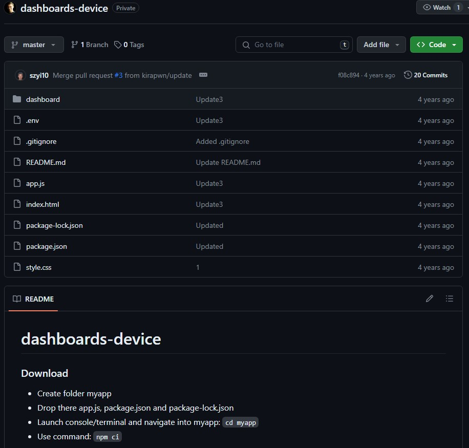

# THIS IS ORIGINAL CODE MADE 4 YEARS AGO

# dashboards-device

### Download

- Create folder myapp
- Drop there app.js, package.json and package-lock.json
- Launch console/terminal and navigate into myapp: `cd myapp`
- Use command: `npm ci`

### Launch

- To launch app.js type: `node app.js`
- Add Firefox to Startup Applications
- Set index.html as home page
- Download "Forcefull" addon for Firefox:
  - https://addons.mozilla.org/pl/firefox/addon/forcefull/
- Download "unclutter" to audo hide cursor:
  - `sudo apt-get install unclutter`
